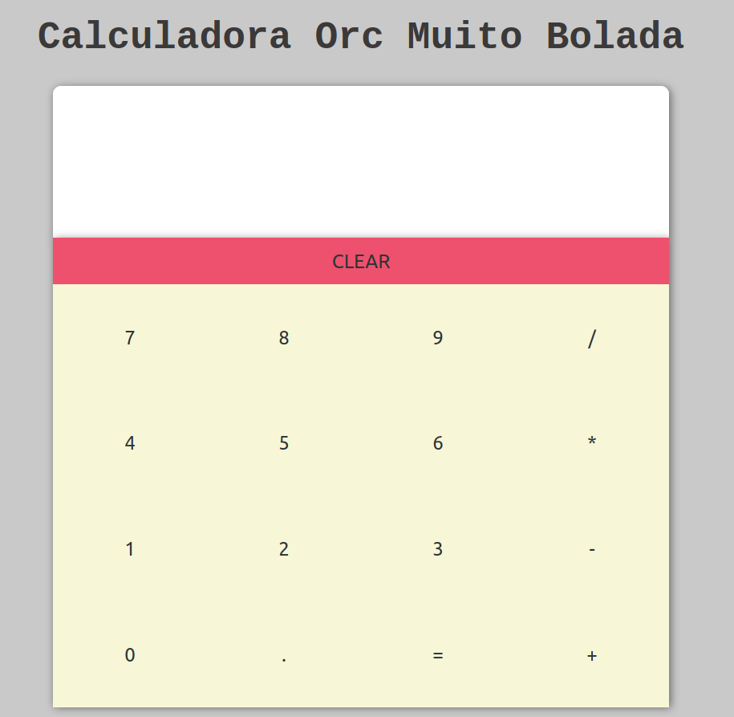
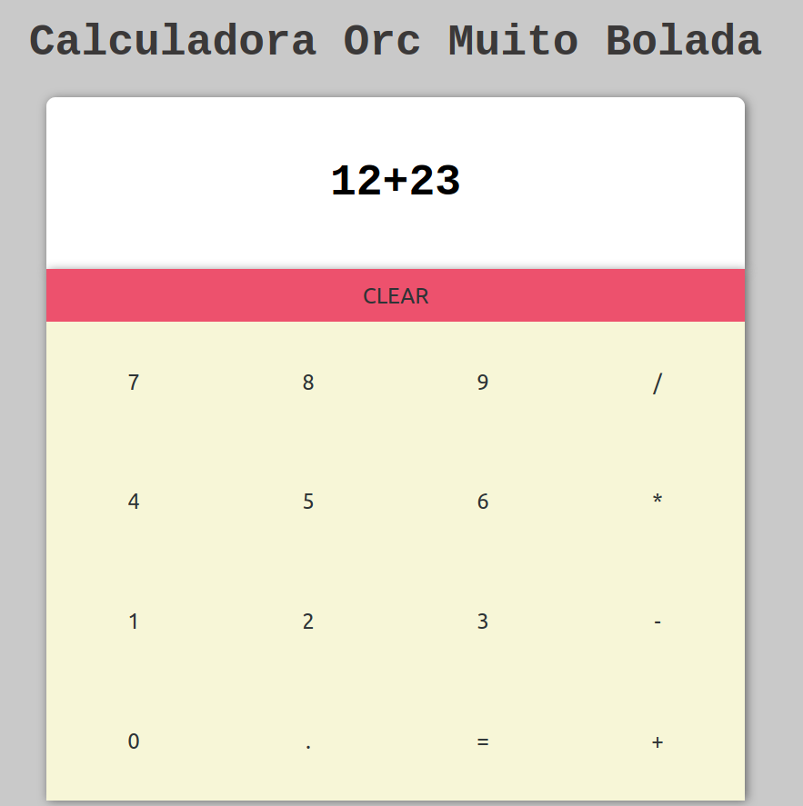
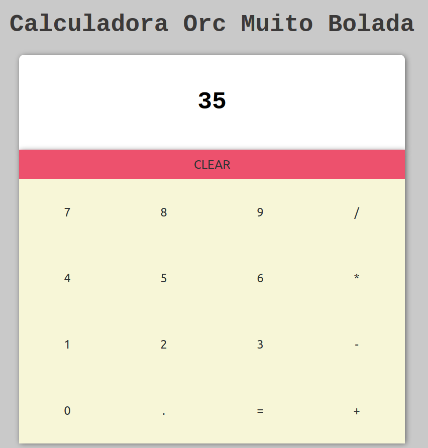

# OrchallengeV1 - React

Projeto de treinamento e estudo promovido pela Orc'estra Gamificação

## Execução

Para executar o projeto é necessário executar em ordem: 
```
git clone https://github.com/juniopereirab/OrchallengeV1-React

cd OrchallengeV1-React

yarn install

yarn start
```

O projeto será executado em http://localhost:1234

## Screenshots



